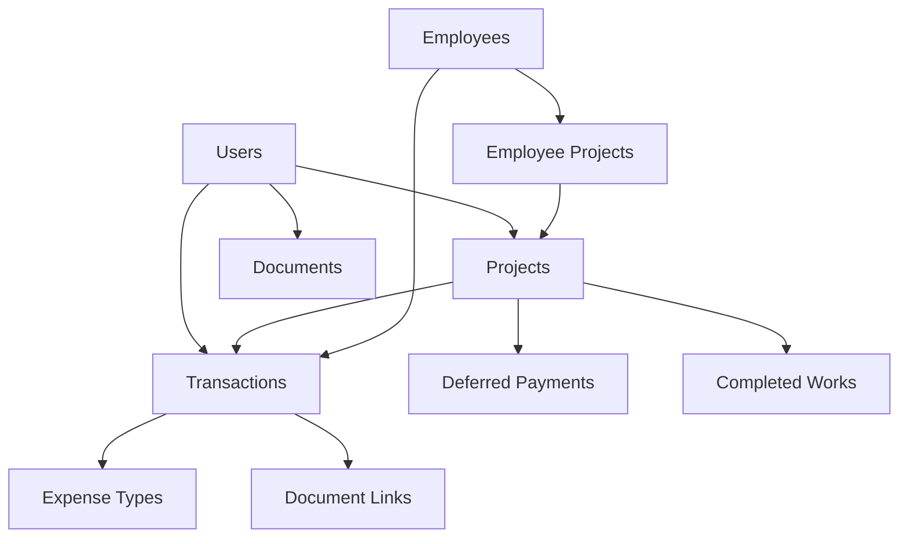

# 🗄️ تصميم قاعدة البيانات - نظام المحاسبة العربي

> نظام قاعدة بيانات شامل ومتكامل لإدارة العمليات المحاسبية والمالية

## 📁 محتويات المجلد

| الملف | الوصف | الغرض |
|-------|--------|-------|
| `complete-database-schema.sql` | المخطط الكامل لقاعدة البيانات | إنشاء جميع الجداول والعلاقات والفهارس |
| `sample-data.sql` | بيانات تجريبية شاملة | اختبار النظام وتطوير التطبيق |
| `common-queries.sql` | استعلامات وتقارير شائعة | تقارير مالية وإحصائيات مفيدة |
| `database-schema-overview.md` | نظرة عامة على التصميم | فهم هيكل قاعدة البيانات |
| `implementation-guide.md` | دليل التنفيذ والتطبيق | خطوات النشر والصيانة |
| `README.md` | هذا الملف | دليل شامل للمجلد |

## 🎯 نظرة عامة على النظام

### الميزات الرئيسية

🔹 **إدارة المشاريع الشاملة**
- تتبع تقدم المشاريع والميزانيات
- ربط المشاريع بالعملاء والمعاملات
- إدارة فرق العمل والمهام

🔹 **النظام المالي المتكامل**
- معاملات الدخل والمصاريف
- تتبع المدفوعات المؤجلة
- تحليل مالي متقدم
- إدارة الميزانيات والتحكم في التكاليف

🔹 **إدارة الموظفين والرواتب**
- ملفات الموظفين الشاملة
- تتبع الرواتب والمدفوعات
- ربط الموظفين بالمشاريع
- إحصائيات الأداء

🔹 **نظام الوثائق والملفات**
- رفع وإدارة المستندات
- ربط الملفات بالمعاملات والمشاريع
- صلاحيات متدرجة للوصول
- إدارة إصدارات الملفات

🔹 **التقارير والتحليلات**
- تقارير مالية تفصيلية
- إحصائيات الأداء
- تحليل الاتجاهات
- تقارير مخصصة

🔹 **الأمان والمراقبة**
- سجل شامل للأنشطة
- نظام إشعارات متقدم
- مستويات صلاحيات متعددة
- نسخ احتياطية تلقائية

## 🚀 البدء السريع

### 1. إعداد قاعدة البيانات

```bash
# إنشاء قاعدة البيانات
createdb arabic_accounting_system

# تطبيق المخطط
psql -d arabic_accounting_system -f complete-database-schema.sql

# إدخال البيانات التجريبية (اختياري)
psql -d arabic_accounting_system -f sample-data.sql
```

### 2. اختبار النظام

```bash
# تشغيل الاستعلامات التجريبية
psql -d arabic_accounting_system -f common-queries.sql
```

### 3. التكامل مع التطبيق

```javascript
// مثال اتصال Node.js
const { Pool } = require('pg');

const pool = new Pool({
    user: 'accounting_user',
    host: 'localhost',
    database: 'arabic_accounting_system',
    password: 'your_password',
    port: 5432,
});
```

## 📊 هيكل قاعدة البيانات

### الجداول الأساسية

#### 👥 إدارة المستخدمين
- `users` - المستخدمين والصلاحيات
- `employees` - بيانات الموظفين
- `employee_projects` - ربط الموظفين بالمشاريع

#### 📋 إدارة المشاريع
- `projects` - المشاريع والعملاء
- `completed_works` - الأعمال المنجزة
- `completed_work_documents` - وثائق الأعمال

#### 💰 النظام المالي
- `transactions` - جميع المعاملات المالية
- `expense_types` - أنواع المصاريف
- `deferred_payments` - المدفوعات المؤجلة
- `budget_tracking` - تتبع الميزانيات

#### 📄 إدارة الوثائق
- `documents` - الملفات والمستندات
- `document_transaction_links` - ربط الوثائق بالمعاملات

#### 🔔 النظام الإداري
- `activity_logs` - سجل الأنشطة
- `notifications` - الإشعارات
- `settings` - إعدادات النظام
- `custom_reports` - التقارير المخصصة

#### 🔗 التكاملات
- `whatsapp_messages` - رسائل واتساب
- `backups` - النسخ الاحتياطية

### العلاقات الرئيسية



## 📈 التقارير المتاحة

### التقارير المالية
- إجمالي الدخل والمصاريف الشهرية
- تحليل المصاريف حسب النوع
- تتبع الميزانيات والانحرافات
- اتجاهات الدخل والمصاريف

### تقارير المشاريع
- حالة المشاريع والتقدم
- التحليل المالي للمشاريع
- أداء فرق العمل
- الأعمال المكتملة والجودة

### تقارير الموظفين
- إجمالي الرواتب والمدفوعات
- إنتاجية الموظفين
- توزيع الموظفين على المشاريع
- تحليل ساعات العمل

### تقارير إدارية
- نشاط المستخدمين
- إحصائيات الوثائق
- المدفوعات المستحقة والمتأخرة
- مؤشرات الأداء الرئيسية

## 🔧 أمثلة الاستعلامات

### استعلام الدخل الشهري
```sql
SELECT 
    EXTRACT(MONTH FROM date) as الشهر,
    SUM(amount) as إجمالي_الدخل
FROM transactions 
WHERE type = 'income' 
    AND status = 'completed'
    AND EXTRACT(YEAR FROM date) = 2024
GROUP BY EXTRACT(MONTH FROM date)
ORDER BY الشهر;
```

### استعلام تقدم المشاريع
```sql
SELECT 
    name as المشروع,
    progress as التقدم,
    budget as الميزانية,
    spent_amount as المنفق,
    budget - spent_amount as المتبقي
FROM projects 
WHERE status = 'active'
ORDER BY progress DESC;
```

### استعلام المدفوعات المتأخرة
```sql
SELECT 
    title as العنوان,
    amount as المبلغ,
    due_date as تاريخ_الاستحقاق,
    CURRENT_DATE - due_date as أيام_التأخير
FROM deferred_payments 
WHERE status = 'pending' 
    AND due_date < CURRENT_DATE
ORDER BY due_date ASC;
```

## 🛡️ الأمان والحماية

### مستويات الصلاحيات
- **admin** - مدير عام (جميع الصلاحيات)
- **manager** - مدير (إدارة المشاريع والتقارير)
- **accountant** - محاسب (العمليات المالية)
- **user** - مستخدم عادي (عرض محدود)

### ميزات الأمان
- ✅ تشفير كلمات المرور
- ✅ تسجيل جميع الأنشطة
- ✅ صلاحيات متدرجة للبيانات
- ✅ حماية من SQL Injection
- ✅ التحقق من صحة البيانات

## 📱 التكامل مع التطبيقات

### دعم API RESTful
النظام مصمم للعمل مع:
- تطبيقات الويب (React, Vue, Angular)
- تطبيقات المحمول (React Native, Flutter)
- أنظمة سطح المكتب (Electron)

### مثال API Endpoint
```javascript
// GET /api/projects
{
  "data": [
    {
      "id": 1,
      "name": "موقع التجارة الإلكترونية",
      "status": "active",
      "budget": 15000,
      "progress": 45,
      "client_name": "شركة النور للتجارة"
    }
  ],
  "total": 1,
  "page": 1
}
```

## 🔄 النسخ الاحتياطي والصيانة

### النسخ الاحتياطي التلقائي
- نسخة يومية تدريجية
- نسخة أسبوعية كاملة
- نسخة شهرية أرشيفية
- ضغط وتشفير البيانات

### الصيانة الدورية
- تحديث الإحصائيات
- إعادة فهرسة الجداول
- تنظيف البيانات القديمة
- مراقبة الأداء

## 📚 الوثائق والموارد

### ملفات الوثائق
- [database-schema-overview.md](./database-schema-overview.md) - نظرة عامة مفصلة
- [implementation-guide.md](./implementation-guide.md) - دليل التنفيذ
- [common-queries.sql](./common-queries.sql) - استعلامات جاهزة

### الموارد الخارجية
- [PostgreSQL Documentation](https://www.postgresql.org/docs/)
- [SQL Best Practices](https://www.sqlstyle.guide/)
- [Database Design Patterns](https://en.wikipedia.org/wiki/Database_design)

## 🚨 استكشاف الأخطاء

### مشاكل شائعة وحلولها

**خطأ: relation "table_name" does not exist**
```bash
# تأكد من تطبيق المخطط
psql -d arabic_accounting_system -f complete-database-schema.sql
```

**بطء في الاستعلامات**
```sql
-- تحليل الاستعلام
EXPLAIN ANALYZE SELECT * FROM transactions WHERE date > '2024-01-01';

-- إضافة فهرس إذا لزم الأمر
CREATE INDEX idx_transactions_date ON transactions(date);
```

**مشاكل في الاتصال**
```bash
# تحقق من حالة PostgreSQL
sudo systemctl status postgresql

# إعادة تشغيل الخدمة
sudo systemctl restart postgresql
```

## 🎯 التطوير المستقبلي

### ميزات مخططة
- [ ] تكامل مع البنوك الإلكترونية
- [ ] ذكاء اصطناعي لتحليل المصاريف
- [ ] تطبيق محمول متكامل
- [ ] نظام موافقات متقدم
- [ ] تقارير تفاعلية بالذكاء الاصطناعي
- [ ] تكامل مع أنظمة ERP خارجية

### التحسينات المقترحة
- تحسين الأداء للبيانات الكبيرة
- إضافة المزيد من التقارير
- تحسين واجهة إدارة الوثائق
- نظام إشعارات أكثر ذكاءً

## 📞 الدعم والمساهمة

### الحصول على المساعدة
- مراجعة الوثائق أولاً
- فحص ملفات السجل
- استخدام أدوات التشخيص المدمجة

### المساهمة في التطوير
- تحسين الاستعلامات الموجودة
- إضافة تقارير جديدة
- تحسين الأداء
- إضافة اختبارات

---

## ⭐ الخلاصة

هذا النظام يوفر قاعدة بيانات شاملة ومرنة لإدارة جميع العمليات المحاسبية والمالية. تم تصميمه ليكون:

- **شامل** - يغطي جميع احتياجات المحاسبة
- **مرن** - قابل للتخصيص والتوسع
- **آمن** - يحمي البيانات الحساسة
- **سريع** - محسن للأداء العالي
- **موثوق** - مع نظام نسخ احتياطي متقدم

**تم تصميم هذا النظام بحب ❤️ للمجتمع العربي في مجال البرمجة والمحاسبة**
