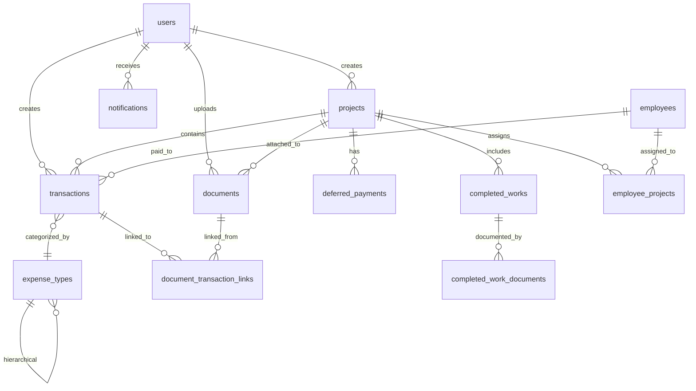

# مخطط قاعدة البيانات الشامل - نظام المحاسبة العربي
## Complete Database Schema - Arabic Accounting System

## 📊 نظرة عامة على الجداول

### 1. 👥 إدارة المستخدمين والموظفين
- **users** - المستخدمين والمديرين
- **employees** - الموظفين والعاملين
- **employee_projects** - ربط الموظفين بالمشاريع

### 2. 📋 إدارة المشاريع
- **projects** - بيانات المشاريع
- **completed_works** - الأعمال المكتملة
- **completed_work_documents** - مستندات الأعمال المكتملة

### 3. 💰 النظام المالي
- **transactions** - جميع المعاملات المالية
- **expense_types** - أنواع المصاريف
- **deferred_payments** - المدفوعات المؤجلة
- **budget_tracking** - تتبع الميزانيات

### 4. 📄 إدارة الوثائق
- **documents** - الملفات والمستندات
- **document_transaction_links** - ربط الوثائق بالمعاملات

### 5. 🔔 النظام الإداري
- **activity_logs** - سجل الأنشطة
- **notifications** - الإشعارات
- **settings** - إعدادات النظام
- **custom_reports** - التقارير المخصصة

### 6. 🔗 التكاملات الخارجية
- **whatsapp_messages** - رسائل واتساب
- **backups** - النسخ الاحتياطية

## 🔗 العلاقات الرئيسية

## 📈 الإحصائيات والتقارير

### Views المُعرَّفة مسبقاً:
1. **transaction_summary** - ملخص المعاملات الشهرية
2. **project_financial_summary** - الملخص المالي للمشاريع
3. **overdue_payments** - المدفوعات المتأخرة

### Functions للحسابات:
1. **calculate_project_progress()** - حساب تقدم المشروع
2. **update_updated_at_column()** - تحديث وقت آخر تعديل

## 🔍 فهارس الأداء

### فهارس المعاملات المالية:
- تاريخ المعاملة
- نوع المعاملة (دخل/مصروف)
- معرف المشروع
- منشئ المعاملة
- نوع المصروف
- حالة المعاملة

### فهارس المشاريع:
- حالة المشروع
- منشئ المشروع
- تواريخ البداية والنهاية

### فهارس الوثائق:
- معرف المشروع
- رافع الملف
- فئة المستند
- مستندات المدير

## 🛡️ القيود والتحقق

### قيود التحقق:
- ✅ المبالغ يجب أن تكون موجبة
- ✅ تاريخ انتهاء المشروع بعد تاريخ البداية
- ✅ أدوار المستخدمين محددة مسبقاً
- ✅ أنواع المعاملات صحيحة
- ✅ تقييم العمل بين 1-5
- ✅ نسبة تقدم المشروع بين 0-100

### Triggers للتحديث التلقائي:
- 🔄 تحديث `updated_at` عند التعديل
- 🔄 تسجيل الأنشطة تلقائياً

## 💾 البيانات الأولية

### أنواع المصاريف الافتراضية:
1. مصروف عام
2. راتب
3. إيجار
4. مواصلات
5. اتصالات
6. كهرباء
7. مياه
8. مكتبية
9. صيانة
10. تسويق
11. ضرائب
12. تأمين

### الإعدادات الافتراضية:
- اسم التطبيق
- العملة (USD)
- المنطقة الزمنية
- اللغة
- عدد الخانات العشرية
- تكرار النسخ الاحتياطي
- حد أقصى لحجم الملف
- أنواع الملفات المسموحة

## 🔐 الأمان والصلاحيات

### مستويات المستخدمين:
- **admin** - مدير عام (جميع الصلاحيات)
- **manager** - مدير (صلاحيات محدودة)
- **accountant** - محاسب (العمليات المالية)
- **user** - مستخدم عادي (عرض فقط)

### حماية البيانات:
- 🔒 كلمات مرور مُشفَّرة
- 🔒 رموز إعادة تعيين محدودة الوقت
- 🔒 تسجيل جميع الأنشطة
- 🔒 صلاحيات متدرجة للوثائق

## 📱 التكاملات

### WhatsApp Integration:
- إرسال إشعارات
- تذكيرات المدفوعات
- تنبيهات المشاريع

### نظام النسخ الاحتياطي:
- نسخ كاملة وتدريجية
- ضغط البيانات
- جدولة تلقائية

## 🚀 الأداء والتحسين

### استراتيجيات التحسين:
1. **فهرسة ذكية** للاستعلامات الشائعة
2. **تقسيم البيانات** حسب التاريخ
3. **ذاكرة تخزين مؤقت** للتقارير
4. **ضغط البيانات** القديمة
5. **أرشفة تلقائية** للمعاملات القديمة

### مراقبة الأداء:
- 📊 إحصائيات الاستعلامات
- 📊 معدل استخدام القرص
- 📊 وقت الاستجابة
- 📊 عدد المستخدمين المتصلين

## 🔄 خطة التطوير المستقبلية

### المرحلة القادمة:
1. **تكامل API** مع البنوك
2. **ذكاء اصطناعي** لتحليل المصاريف
3. **تطبيق موبايل** أصلي
4. **تقارير تفاعلية** متقدمة
5. **نظام موافقات** متدرج
6. **تكامل محاسبي** مع أنظمة خارجية

---

*هذا المخطط يغطي جميع احتياجات نظام المحاسبة العربي الحديث مع إمكانية التوسع والتطوير المستقبلي.*
